#self-driving-car
## #python #raspberrypi #windows10 #neuralnetwork #artificialintellegence #tensorflow #keras #opencv #c #arduino  

# this car runs on image preprocessing in OpenCV and using Keras (TensorFlow backend) to train a neural network that could drive this car,

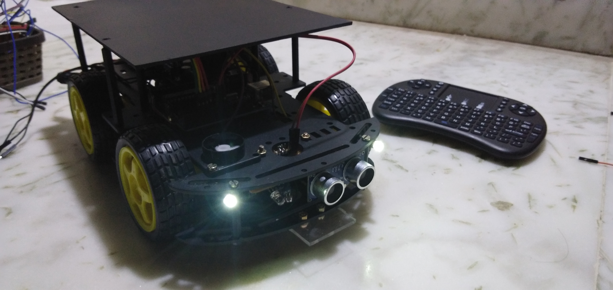

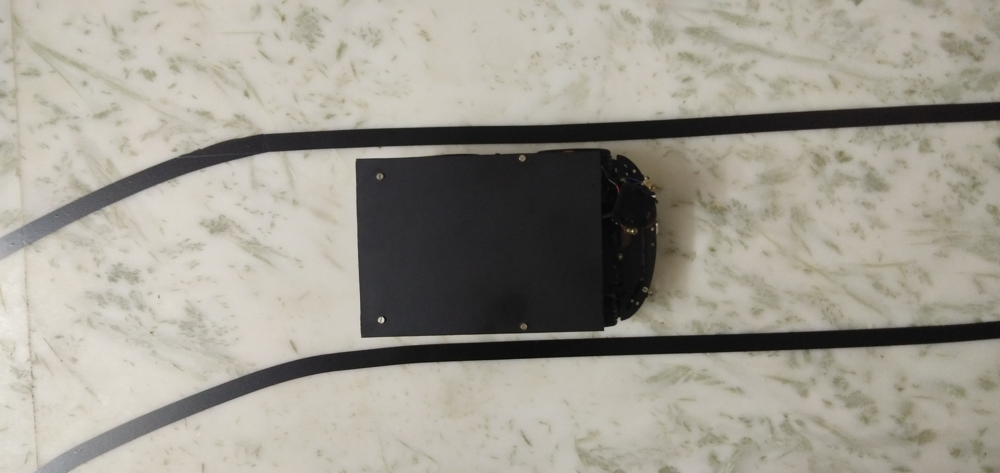

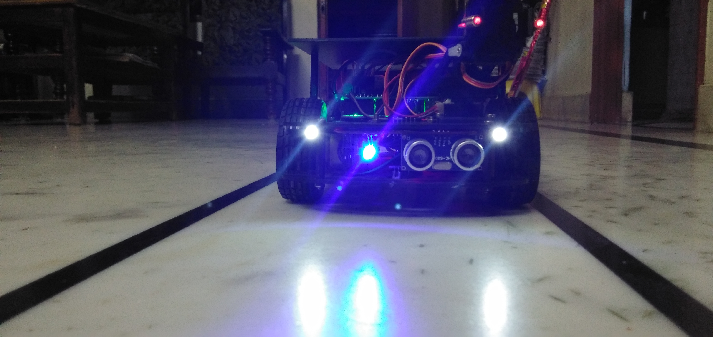

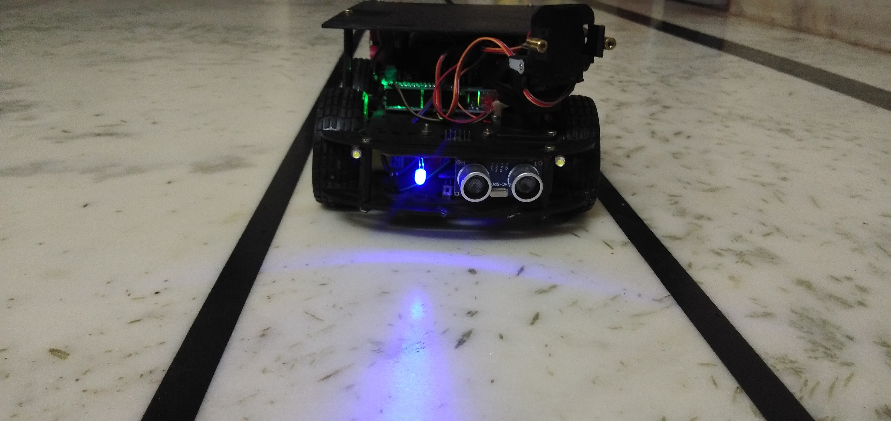

### in start training wer done using logitech cam , but in this camera images wer unale to crop, due to buit-in procesors of the camera, and so shifted with raspberry pi cam, and was even more easy to set up configrations ))

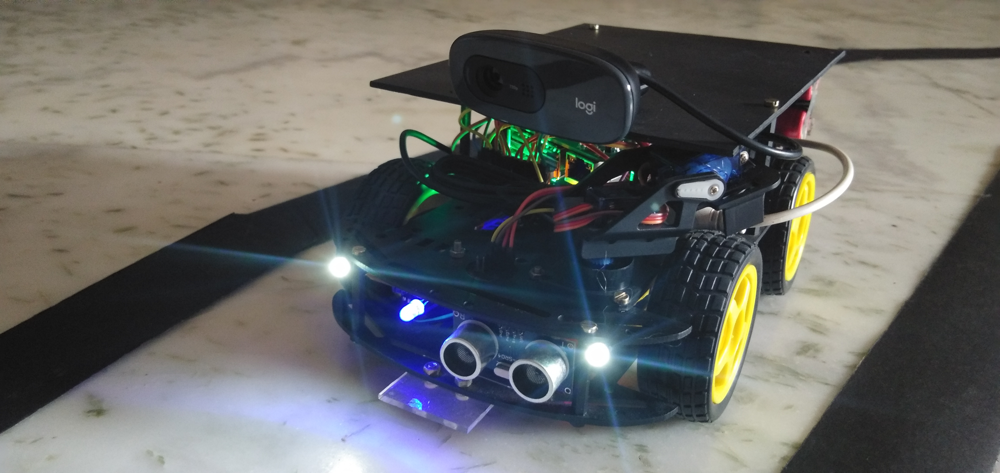

### thought of using another car with all easy setup to collect data , and actually this model worked even better for me <3 and was awesome ;)

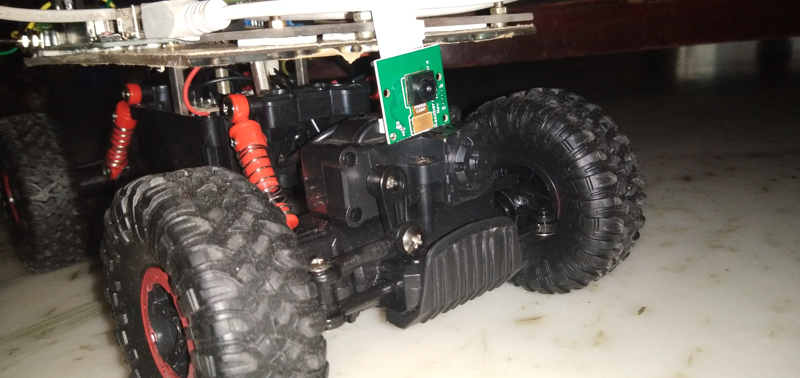

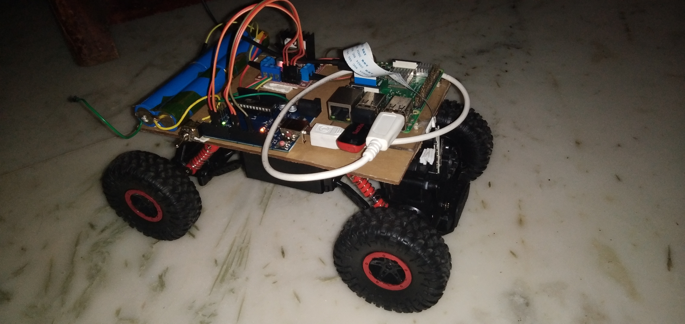

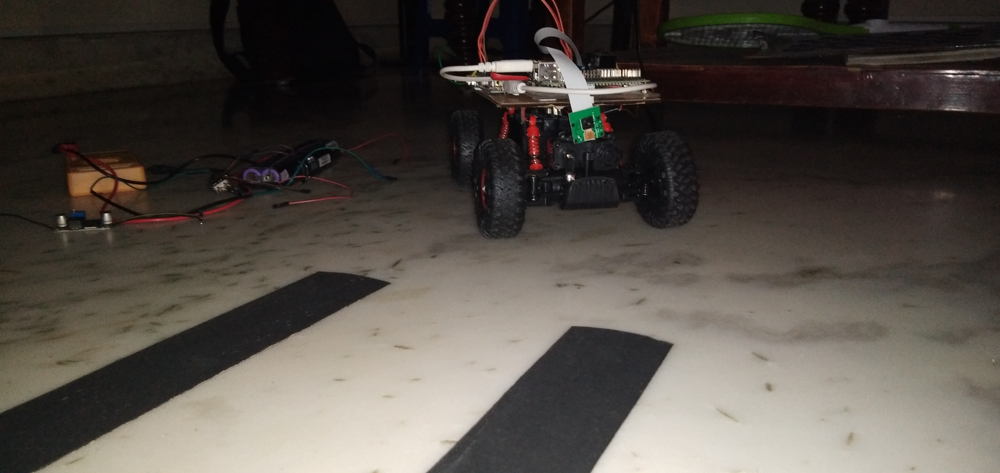

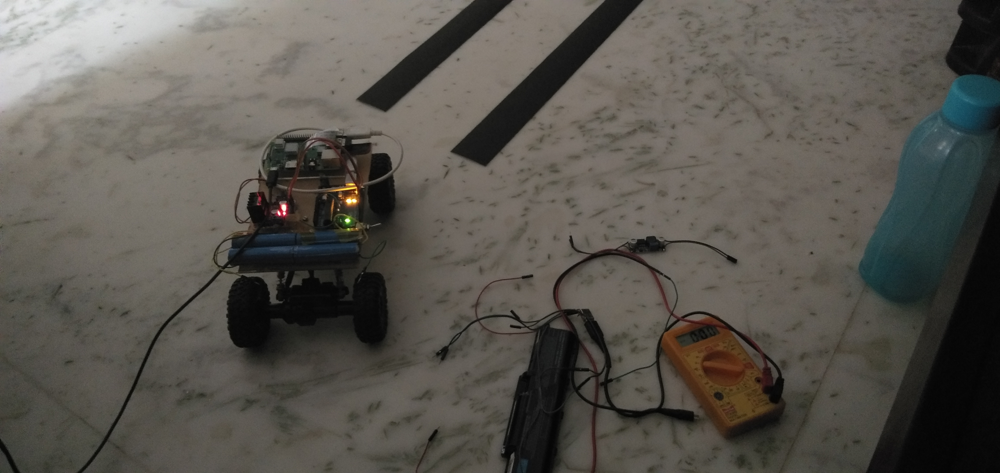

# training ....

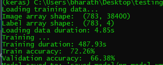

# predictions after trained
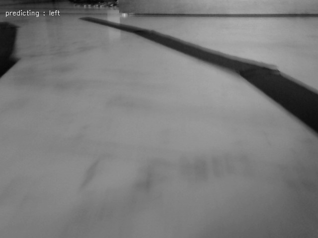

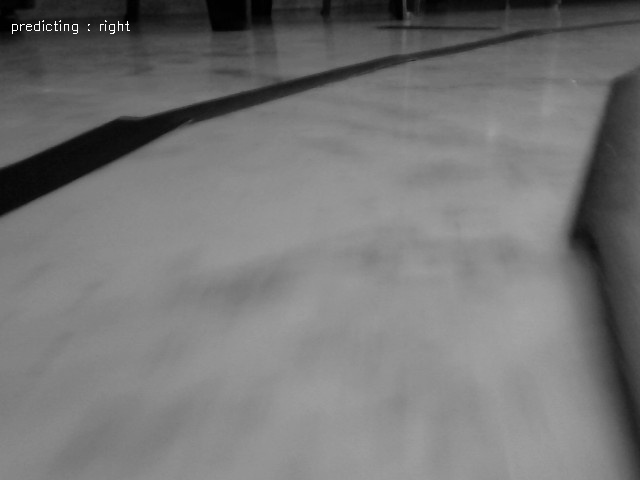

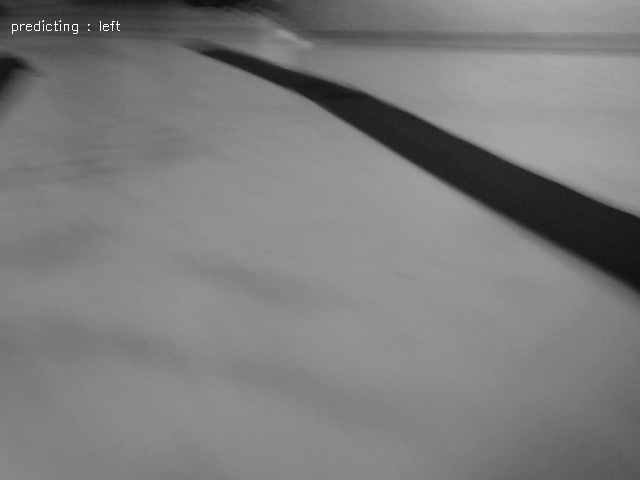

[VIDEO LiNK](https://www.youtube.com/watch?v=LP5Fi0OaX-k)
